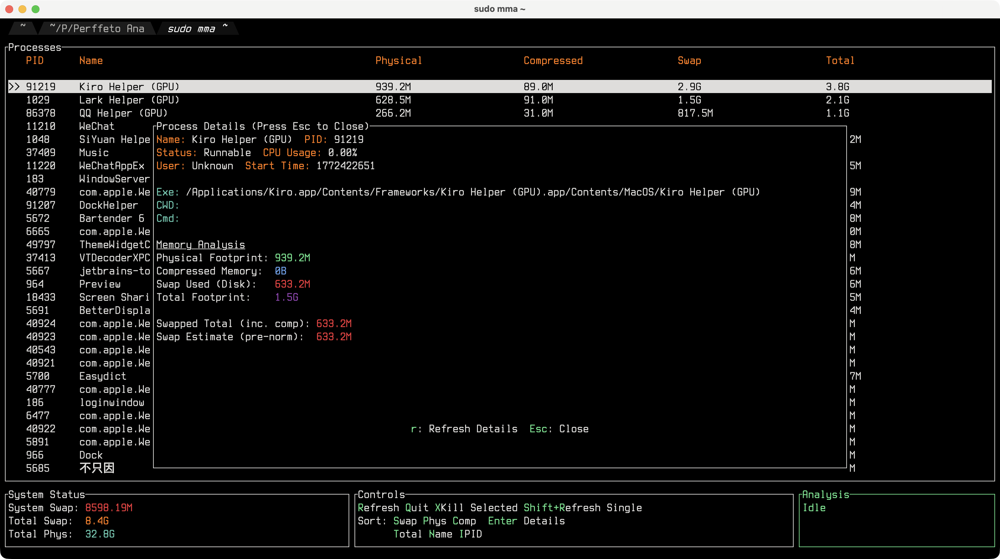

# macmemana

<p align="center">
  
  
</p>

<p align="center">
  <strong>The Ultimate macOS Memory Analysis Tool</strong>
</p>

<p align="center">
  <a href="https://crates.io/crates/macmemana">
    
  </a>
  <a href="https://github.com/W-Mai/macmemana/blob/main/LICENSE">
    
  </a>
  <a href="https://crates.io/crates/macmemana">
    
  </a>
</p>

**macmemana** (or simply `mma`) is a high-performance, terminal-based memory analyzer engineered specifically for macOS. Unlike generic tools, it leverages Apple's native `footprint` and `vmmap` utilities to demystify complex memory metrics—distinguishing between physical footprint, compressed memory, and actual swap usage with precision.

<p align="center">
  
</p>

## ✨ Features

- **🚀 Instant Startup**: Launches immediately with a lightweight scan, then progressively streams deep memory analysis in the background. No more staring at loading screens.
- **💎 Accurate Swap Accounting**: Solves the "missing swap" mystery by digging into `footprint` data to calculate the exact `swapped_total` per process, normalizing it against system-wide kernel reports.
- **📊 Interactive TUI**: A beautiful, responsive interface built with `ratatui`. Sort, filter, and monitor processes in real-time.
- **⚡ Dual Binary Support**: Install once, use `macmemana` or the handy short alias `mma`.
- **🛠 CLI Mode**: Robust one-shot output mode for scripts, generating detailed reports or JSON-friendly data.
- **🛡 System-Aware**: Automatically handles macOS-specific memory quirks (compressed memory, purgeable pages, shared cache) that confuse cross-platform tools.

## 📦 Installation

### From Crates.io

```bash
cargo install macmemana
```

### From Source

```bash
git clone https://github.com/W-Mai/macmemana.git
cd macmemana
cargo install --path .
```

## 🚀 Usage

### Interactive Mode (TUI)

For the most accurate results—especially for system processes and other users' applications—running with `sudo` is highly recommended.

```bash
sudo mma
# or
sudo macmemana
```

> **Why sudo?** macOS restricts access to detailed memory maps (`vmmap`/`footprint`) of processes not owned by the current user. Without root privileges, `mma` can only deeply analyze your own processes, leading to incomplete system-wide statistics.

### CLI Mode

Generate a detailed memory report directly to stdout:

```bash
sudo mma --cli
```

Sort by specific columns:

```bash
# Sort by physical footprint (descending)
sudo mma --cli --sort phys

# Sort by swap usage (descending) - Default
sudo mma --cli --sort swap
```

## ⌨️ Keyboard Shortcuts

| Key | Action |
| :--- | :--- |
| `q` | **Quit** application |
| `r` | **Refresh** (trigger a deep rescan) |
| `j` / `↓` | Select **Next** process |
| `k` / `↑` | Select **Previous** process |
| `s` | Sort by **Swap** (Descending) |
| `p` | Sort by **Physical** Memory (Descending) |
| `c` | Sort by **Compressed** Memory (Descending) |
| `t` | Sort by **Total** Memory (Descending) |
| `n` | Sort by **Name** (Ascending) |
| `i` | Sort by **PID** (Ascending) |
| `x` | **Kill** selected process (send SIGKILL) |

## 🛠 Technical Details

`macmemana` uses a multi-stage analysis pipeline:
1. **Fast Path**: Immediately gathers basic process info via `sysinfo`.
2. **Deep Path**: Spawns background workers to run `footprint` on process batches.
3. **Normalization**: Aggregates per-process swap estimates and reconciles them with `sysctl vm.swapusage` to ensure the "Total Swap" matches the OS report perfectly.

## 📄 License

MIT License © 2026 Benign X
